  <!-- ======================== HEADER UI WINDOW (ICE BLUE & MINT BLUE) ======================== -->
  

    

  <!-- ======================== ANIMATED TYPING BANNER ======================== -->
  

    

  <!-- ======================== TERMINAL NEOFETCH BIO ======================== -->
  

 

<!-- ======================== 01. FLAGSHIP ENGINEERING & DEPLOYMENTS ======================== -->

  

<table width="100%">
  <tr>
    <td width="50%" valign="top">
      <h3 align="left">🤖 Tankbot 2025 (Raspberry Pi 4B Edition)</h3>
      

        <b>Autonomous tracked mobile rover</b> ported from STM32 to Raspberry Pi 4B. Features real-time touch UI web controller, dual ultrasonic collision avoidance, camera live-streaming & precision motor PWM control.
      

      

        
        
        
        
      

      

        <a href="https://github.com/CARLEELTECH0/tankbot-2025-raspberrypi"><b>Explore Repository →</b></a>
      

    </td>
    <td width="50%" valign="top">
      <h3 align="left">⚡ ESP32 Smart Panel & Circuit Breaker</h3>
      

        <b>Enterprise IoT energy distribution panel</b> replacing mechanical sub-panels with software-defined tripping breakers, PZEM-004T AC power telemetry, hazard trip algorithms & AI MCP agent control.
      

      

        
        
        
        
      

      

        <a href="https://github.com/CARLEELTECH0/CARLEELTECH0"><b>View Architecture & Spec →</b></a>
      

    </td>
  </tr>
  <tr>
    <td width="50%" valign="top">
      <h3 align="left">🧠 Hermes Autonomous Agent Platform</h3>
      

        <b>Modular enterprise autonomous AI agent platform</b> engineered with modular tool calling, multi-interface architectures (terminal TUI in React Ink, web dashboard, and WhatsApp/Matrix bridges).
      

      

        
        
        
        
      

      

        <a href="https://github.com/CARLEELTECH0/CARLEELTECH0-ecc"><b>Explore Platform →</b></a>
      

    </td>
    <td width="50%" valign="top">
      <h3 align="left">🏢 BizLift AI Transformation Engine</h3>
      

        <b>Production-deployed AI adoption platform</b> delivering diagnostic enterprise roadmaps, ROI projections & actionable AI integration pipelines for businesses. Live in production on Vercel.
      

      

        
        
        
        
      

      

        <a href="https://eternal-magnetar.vercel.app" target="_blank"><b>Launch Live Application ↗</b></a>
      

    </td>
  </tr>
  <tr>
    <td width="50%" valign="top">
      <h3 align="left">🛡️ AutoPay Nigeria & ResolveNG</h3>
      

        <b>Fintech automated recurring payments & dispute engine</b> featuring SHA-256 evidence validation, distributed job queues (BullMQ/Redis), and automated bank debit dispute resolution.
      

      

        
        
        
        
      

      

        <a href="https://github.com/CARLEELTECH0"><b>Explore Fintech Suite →</b></a>
      

    </td>
    <td width="50%" valign="top">
      <h3 align="left">🦿 ELLA AI Wearable & SignalBridge</h3>
      

        <b>Assistive edge IoT firmware and wearable enclosure</b>. Streams real-time speech-to-sign avatar vectors over WebSocket on ESP32-C3 with parametric snap-fit 3D CAD enclosures designed in FreeCAD 1.0.
      

      

        
        
        
        
      

      

        <a href="https://github.com/CARLEELTECH0"><b>Inspect Hardware & CAD →</b></a>
      

    </td>
  </tr>
</table>

 

<!-- ======================== 02. TECH ARSENAL & CORE DISCIPLINES ======================== -->

  

<table width="100%">
  <tr>
    <td width="50%" valign="top">
      <h4 align="left">🤖 Embedded Systems & Robotics</h4>
      

        
      

      

        <code>ESP32-S3/C3</code> • <code>ESP-IDF v5</code> • <code>FreeRTOS</code> • <code>STM32</code> • <code>Sensors (PZEM, Ultrasonic, DHT)</code> • <code>Motor Drivers (L298N, PWM)</code>
      

    </td>
    <td width="50%" valign="top">
      <h4 align="left">📐 Hardware Design & 3D CAD</h4>
      

        
        
         
        
        
      

      

        <code>RF Antenna 50Ω Matching</code> • <code>Power Circuitry</code> • <code>Enclosure Mechanics</code> • <code>Involute Gear Generation</code>
      

    </td>
  </tr>
  <tr>
    <td width="50%" valign="top">
      <h4 align="left">🧠 Autonomous AI & Intelligent Systems</h4>
      

        
      

      

        <code>Model Context Protocol (MCP)</code> • <code>Autonomous Agent Loops</code> • <code>Google Gemini API</code> • <code>MediaPipe Hands & Vision</code> • <code>Edge AI 1D-CNN Audio</code>
      

    </td>
    <td width="50%" valign="top">
      <h4 align="left">🌐 Full-Stack, Cloud & DevOps</h4>
      

        
      

      

        <code>Next.js 16 (App Router)</code> • <code>BullMQ</code> • <code>Express.js</code> • <code>WebSockets</code> • <code>Docker Compose</code> • <code>Linux Admin</code>
      

    </td>
  </tr>
</table>

 

<!-- ======================== 03. REAL-TIME TELEMETRY & ACTIVITY ======================== -->

  

  <table width="100%">
    <tr>
      <td width="50%" align="center" valign="middle">
        
      </td>
      <td width="50%" align="center" valign="middle">
        
      </td>
    </tr>
    <tr>
      <td colspan="2" align="center" valign="middle">
        
      </td>
    </tr>
  </table>

 

<!-- ======================== 04. NEURAL UPLINK & GET IN TOUCH ======================== -->

  

  
  &nbsp;
  
  &nbsp;
  
  &nbsp;
  

    

  <!-- Terminal Footer Status Line -->
  <code>[Process exited with status 0] — Available for Robotics, Embedded IoT &amp; Autonomous AI Engineering Roles</code>

    

  

    
  

